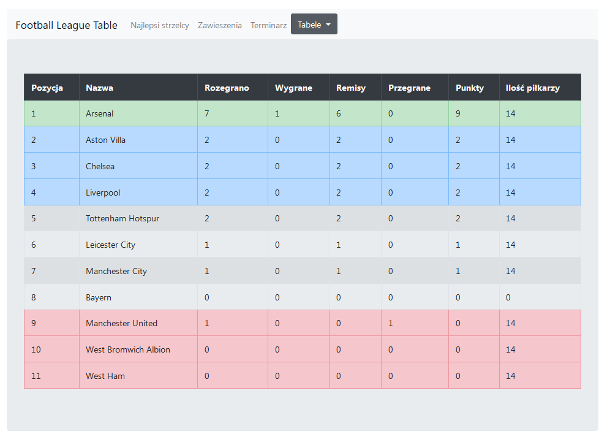

# Football League Database App
  

  
[]  
  

  
## Project idea
  
The app was created for a university class, allowing the user to add, remove, update and view data related to football games (goals, assists, cards).
It was deployed on Heroku, link: https://football-league-table-app.herokuapp.com/
  
## Tech stack used in the project:
  
  Backend: **Node.js + Express**  
  Database: **PostgreSQL**  
  Frontend: **HTML, CSS + EJS**  
  
## Skills gained during project
  
  -> Deeper understanding of Node.js used with Express  
  -> Handling of database such as PostgreSQL  
  -> Connecting to a remote database and working with it (ElephantSQL)  
  -> Deploying an app to Heroku  
  -> Learning Bootstrap  
  
## Things to develop
  
  -> Improve the database functions and triggers (card handling etc.)  
  -> Add admin database privileges (so that a normal user can't change data)  
